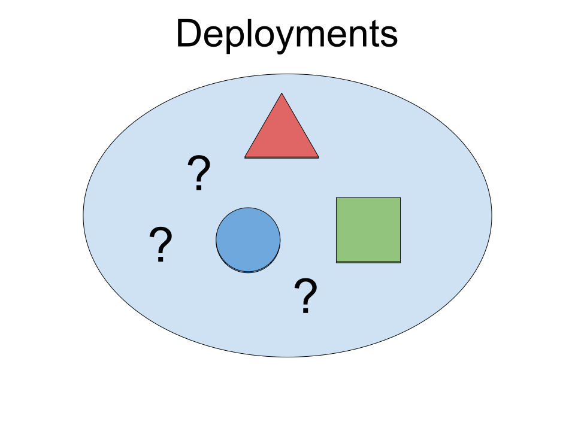
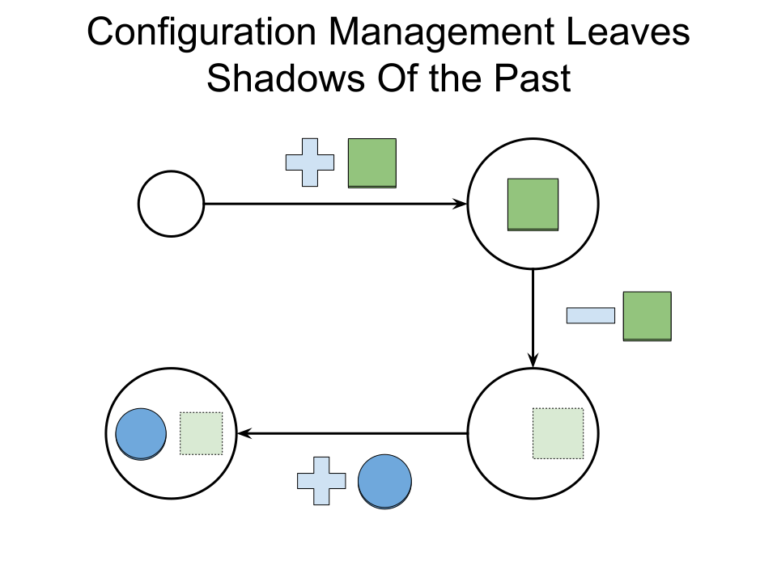
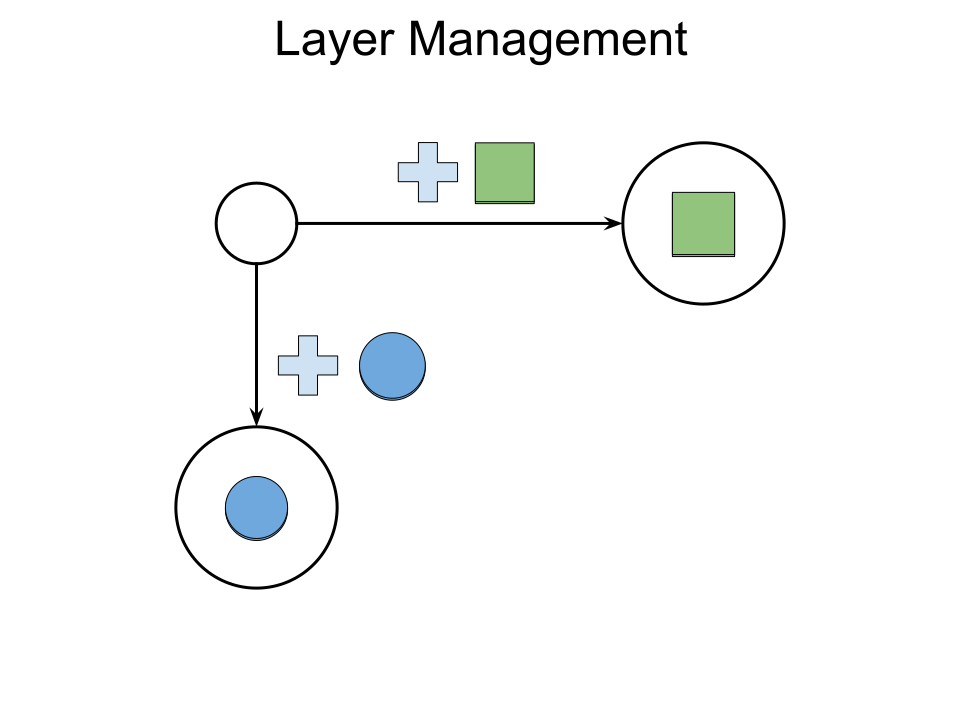
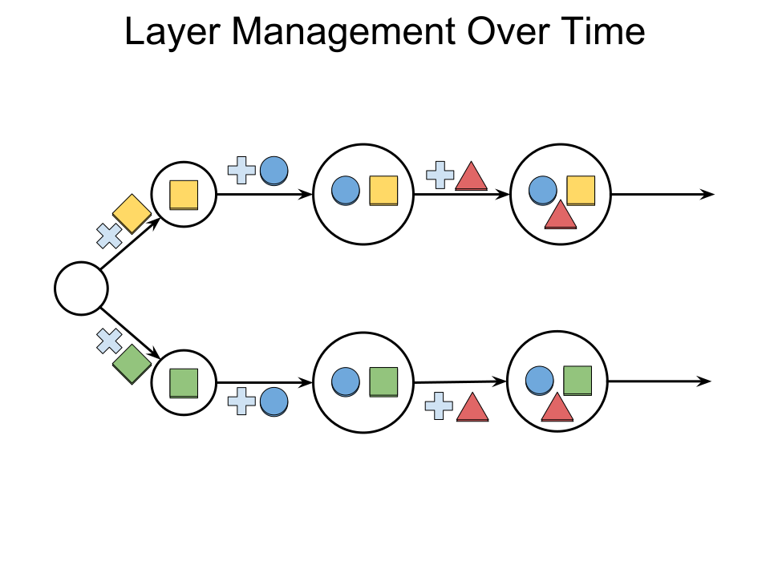
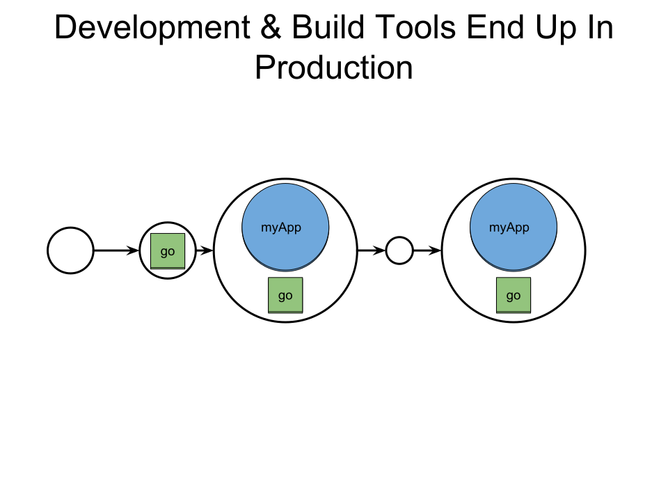
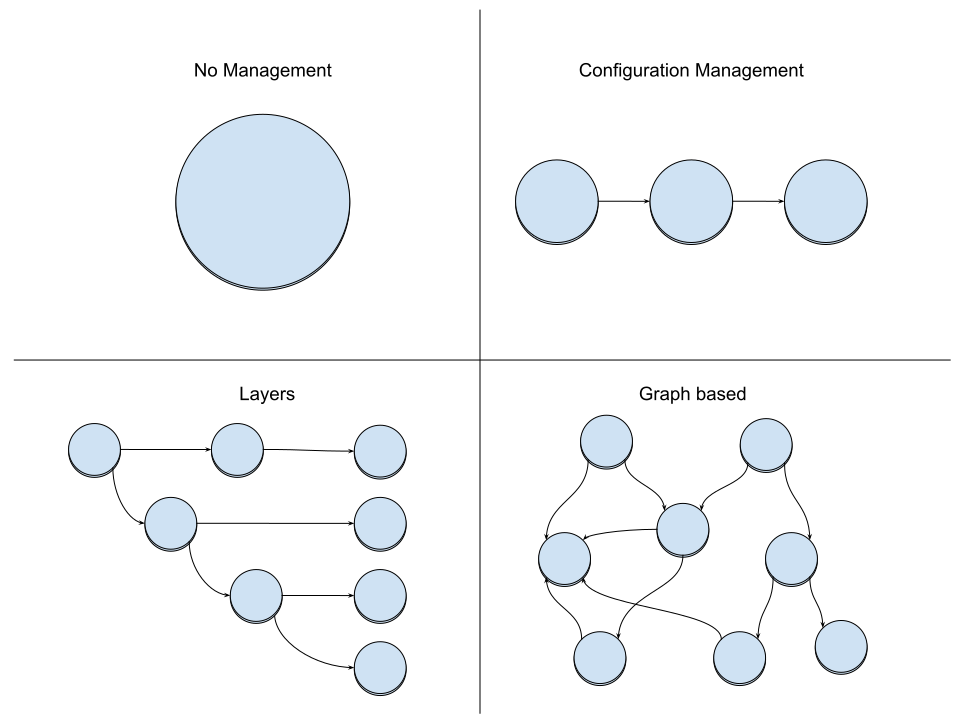
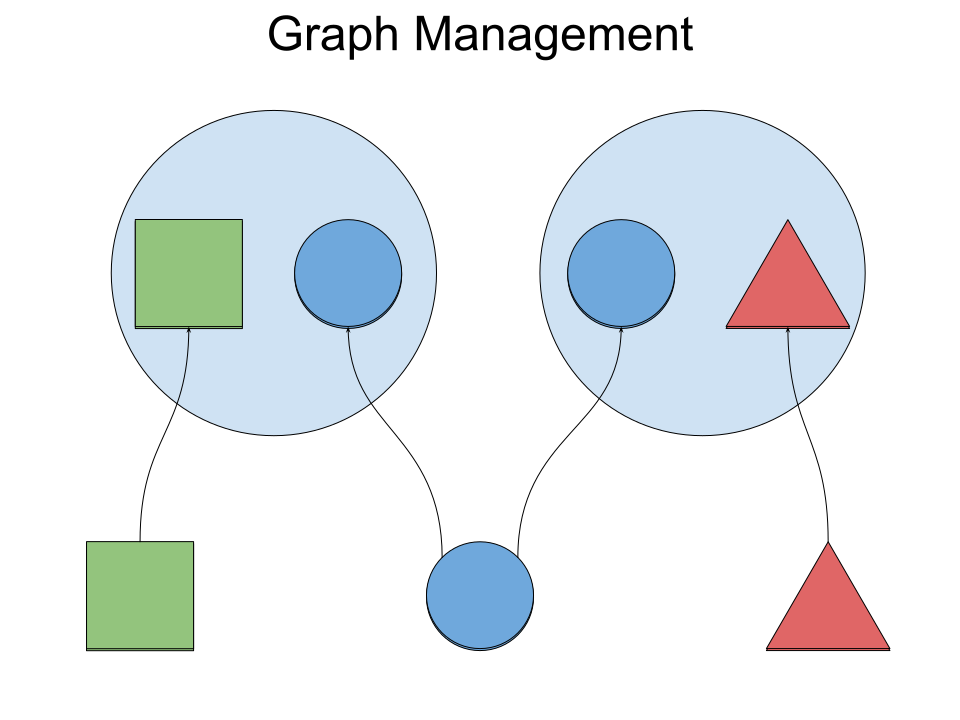
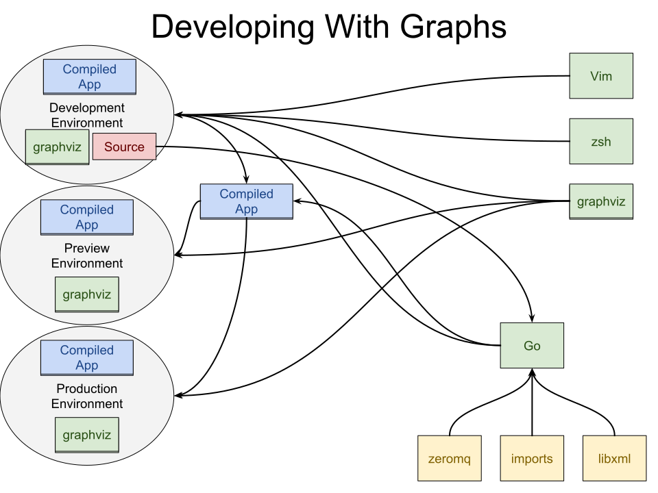
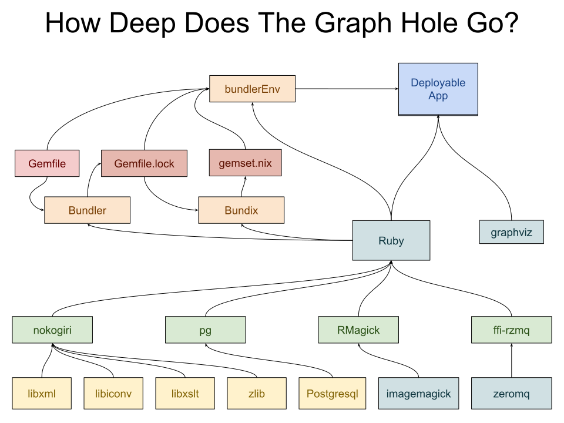
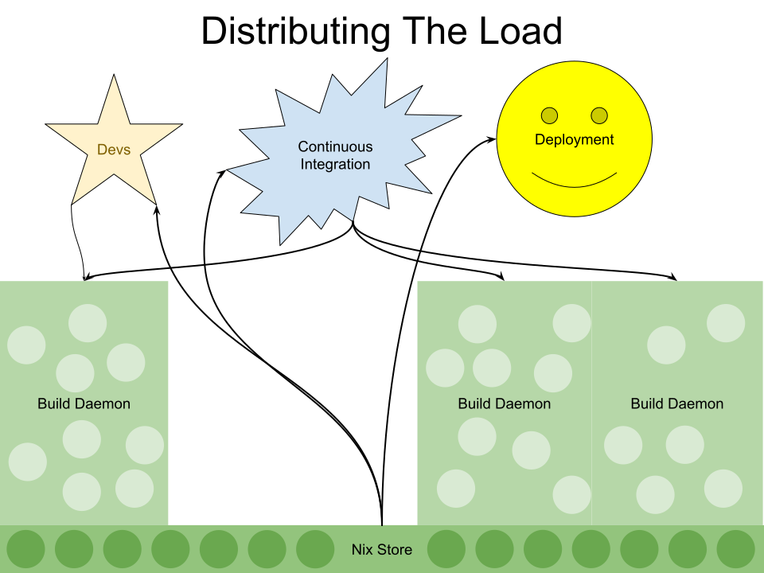

title: Introduction To Nix (Part I)
subtitle: July 2018
author: Michael Fellinger
description: Nix is a powerful package manager for Linux and other Unix systems that makes package management reliable and reproducible.
theme: black

---

## A little history

---

## The present

---

---

---

## Intermezzo

---

---

---

---

---

## Functional programming

Based on _lambda calculus_ by Alonzo Church (1930s).

Abstraction based on functions (_lambda_) and reduction.

* No side effects:
* No mutable variables
* No loops

## The Nix Programming Language

## Some history

The Nix package manager was developed by _Eelco Dolstra_ as part of his PhD research in 2004.

[Nix: A Safe and Policy-Free System for Software Deployment](https://nixos.org/~eelco/pubs/nspfssd-lisa2004-final.pdf)

The core of the language has been improved in the following 14 years, eventually
leading to the creation of NixOS, an operating system entirely built using Nix.

_Eelco Dolstra_ is still the head of the project and recently left the academic
world to work at a Nix consultancy.

## Nix is...

* Reliable
* Reproducible
* Great for developers
* Multi-user, multi-version
* Source/binary model
* Portable

## Reliable

Nix’s purely functional approach ensures that installing or upgrading one package cannot break other packages.

This is because it won’t overwrite dependencies with newer versions that might cause breakage elsewhere.

It allows you to roll back to previous versions, and ensures that no package is in an inconsistent state during an upgrade.

## Reproducible

Nix builds packages in isolation from each other.

This ensures that they are reproducible and don’t have undeclared dependencies.

So if a package works on one machine, it will also work on another.

## Great for developers

Nix makes it trivial to set up and share build environments for your projects, regardless of what programming languages and tools you’re using.

For instance, running the command

`nix-shell '<nixpkgs>' -A firefox`

gives you a Bash shell in which all of Firefox’s build-time dependencies are present and all necessary environment variables are set.

## Multi-user, multi-version

Nix supports multi-user package management:

Multiple users can share a common Nix store securely, don’t need to have root privileges to install software, and can install and use different versions of a package.

## Source/binary model

Conceptually, Nix builds packages from source, but can transparently use binaries from a binary cache if available.

This combines the flexibility of source package management with the convenience of binary package management.

## Portable

Nix runs on Linux, macOS and other systems.

Nixpkgs, the Nix Packages collection, contains ten-thousands of packages, many pre-compiled.

## The Syntax

## Primitive Types

* Integer
* Bool
* Path
* String
* Float

## Integer

<% code do %>
     nix-repl> builtins.typeOf 42
     # "int"

     nix-repl> 21 + 21
     # 42

     nix-repl> 21 - 42
     # -21

     nix-repl> 21 * 2
     # 42

     nix-repl> 41 / 2
     # 20
<% end %>

## Boolean

<% code do %>
     nix-repl> builtins.typeOf true
     # "bool"

     nix-repl> builtins.typeOf false
     # "bool"

     nix-repl> true && false
     # false

     nix-repl> true || false
     # true
<% end %>

## Path

<% code do %>
    nix-repl> builtins.typeOf /tmp
    # "path"

    nix-repl> /tmp + /build
    # /tmp/build

    nix-repl> ./.
    # /home/manveru/github/manveru/scylla
     
    nix-repl> ./..
    # /home/manveru/github/manveru
<% end %>

## String

<% code do %>
     nix-repl> builtins.typeOf "hoge"
     # "string"
     
     nix-repl> "hi" + " there" 
     # "hi there"

     "hi ${toString 2}"
     # "hi 2"
<% end %>

## Float

<% code do %>
     nix-repl> builtins.typeOf 3.1415
     # "float"

     nix-repl> 1.6 + 1.4
     # 2.9

     nix-repl> 41.0 / 2
     # 20.5
<% end %>

IEEE 754 FTW

## Composite Types

* Set
* List
* Functions (_lambda_)

## Set

<% code do %>
    nix-repl> builtins.typeOf {}
    # "set"

    nix-repl> { "a b" = "c"; count = 2; }
    # { "a b" = "c"; count = 2; }

    nix-repl> { count = 2; }.count
    # 2

    nix-repl> { "a b" = "here"; } // { count = 2; }
    # { "a b" = "here"; count = 2; }
<% end %>

## List

<% code do %>
    nix-repl> builtins.typeOf []
    # "list"

    nix-repl> [42 "a b" (3 + 6) [2 3 4] {x = 2;}]
    # [ 42 "a b" 9 [ ... ] { ... } ]

    nix-repl> builtins.elemAt [[2 3 4]] 0
    # [ 2 3 4 ]

    nix-repl> builtins.length [1 2 3]
    # 3
<% end %>

Here we see first signs of lazyness, the list is only evaluated at the top
level.

## Lambda

<% code do %>
    nix-repl> builtins.typeOf (x: x)
    # "lambda"

    nix-repl> x: x + x
    # «lambda @ (string):1:1»

    nix-repl> (x: x + x) 21
    # 42

    nix-repl> let hi = {name, place}: "Hi ${name} in ${place}!";
              in hi { name = "Michael"; place = "Austria"; }
    # "Hi Michael in Austria!"

    nix-repl> let inc = {n, m ? 1}: n + m;
              in inc { n = 2; }
    # 3
<% end %>

Functions are also lazy, so you can use them as first-class values and pass them
around or assign them to variables.

## Builtin lambdas

The `builtins` set contains a lot of lambdas that are used to fetch git repos or
tarballs, bootstrap systems, flow control, and more.

<% code do %>
    nix-repl> builtins.attrNames builtins
    # [ "abort" "all" "any" "attrNames"
    "attrValues" "baseNameOf" "catAttrs" "compareVersions"
    "concatLists" "concatStringsSep" "currentSystem" "currentTime"
    "deepSeq" "derivation" "dirOf" "div" "elem"
    "elemAt" "false"
    "fetchGit" "fetchMercurial" "fetchTarball" "fetchurl"
    "filter" "filterSource" "findFile" "foldl'" "import" 
    "fromJSON" "toJSON" "toXML" 
    "functionArgs" "getAttr" "getEnv" "hasAttr" "hasContext"
    "isAttrs" "isBool" "isFloat" "isFunction" "isInt"
    ... **
<% end %>

## Summary

* Packages are defined as Nix expressions
* Atomic upgrades and rollbacks
* Several versions of the same package in the same system
* Unprivileged package installation
* Manage user environments (dotfiles, packages, etc.)
* Provides isolated environments
* Reproducible builds from source
* Cache available to get pre-compiled packages
* Safe Garbage collection
* Over 40.000 up-to-date packages with 830 maintainers

## Some Links to start with

[Nix](https://nixos.org/nix)

[Nix Pills](https://nixos.org/nixos/nix-pills/index.html)

[Nix Manual](https://nixos.org/nix/manual/)

[Nix Packages collection](https://github.com/nixos/nixpkgs)

[How up to date are NixOS channels?](http://howoldis.herokuapp.com/)

[nix-darwin](https://github.com/LnL7/nix-darwin)
