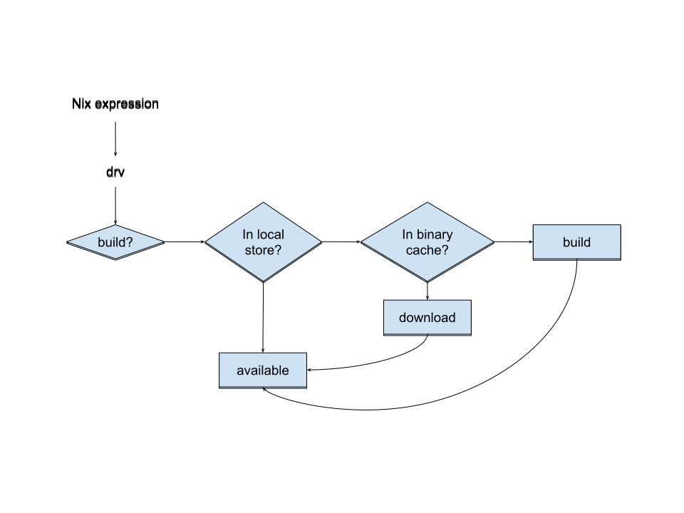
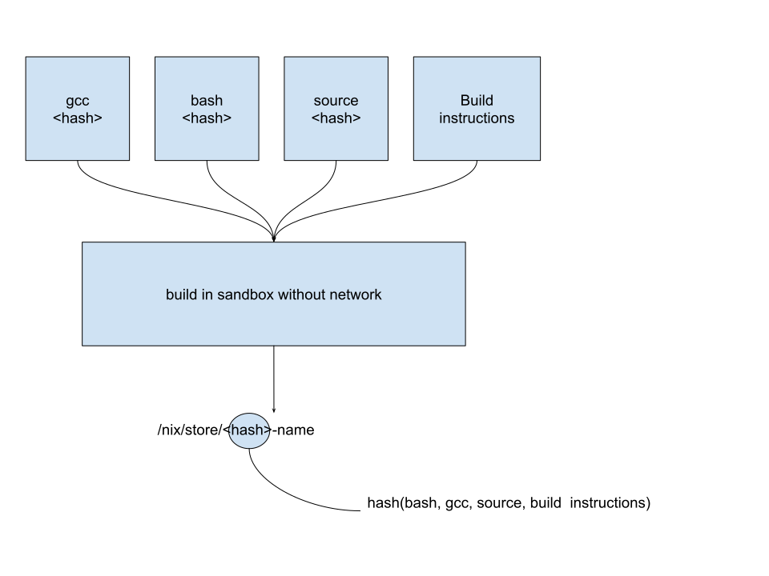
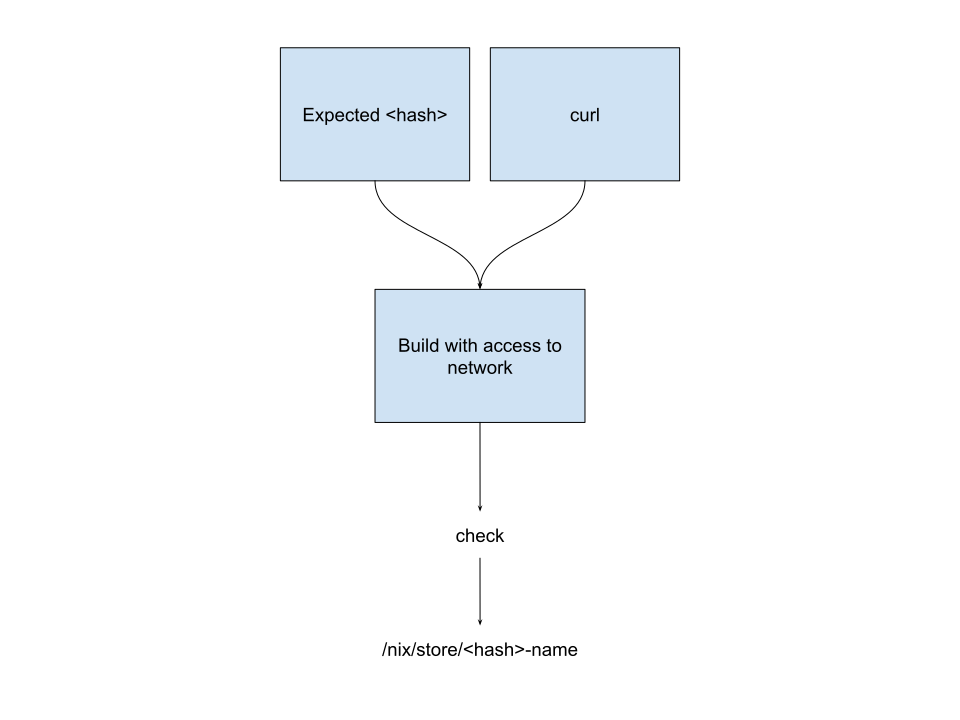

title: Introduction To Nix (Part II)
subtitle: July 2018
author: Michael Fellinger
description: Nix is a powerful package manager for Linux and other Unix systems that makes package management reliable and reproducible.
theme: black

## Getting started

If you're brave enough, you can install the single-user version of Nix.

    curl https://nixos.org/nix/install | sh
    source ~/.nix-profile/etc/profile.d/nix.sh
    nix-channel --add \
      https://nixos.org/channels/nixpkgs-18.03-darwin nixpkgs
    nix-channel --update

## First steps

    nix-channel --add https://nixos.org/channels/nixpkgs-18.03-darwin nixpkgs
    nix-channel --update

    nix-env -iA nixpkgs.hello

    nix-env -u hello

    nix-env --list-generations

    nix-env --rollback
    
    nix-env -e hello
    
    nix-collect-garbage

## Nix Store

<% code do %>
    /nix/store/rqjf7a7i5wh7d0mryy69mzy3nr511acs-home-manager-path/bin/git

    /nix/store/6p18brdpbj91snn4zmg9dwb4yyaf1501-crystal-0.25.0/
    ├── bin
    │   └── crystal
    ├── lib
    │   └── crystal
    └── share
        ├── bash-completion
        ├── doc
        ├── licenses
        ├── man
        └── zsh
<% end %>
        
## Environments

* System wide
* User owned
* Project specific
* Service specific

All reproducible and can reuse each others code!

## Platform independent

Nix runs on Linux (not only NixOS), MacOS, BSD, Windows, and more.
NixOS has been ported to many platforms, so it runs on i686, x86_64, MIPS, ARM, and AArch64
So you can use it on anything from Supercomputers to your Router, also MacBooks and Rasberry Pis.

You don't have to run NixOS to use Nix, although that gives you many benefits.

## What's a Nix Package?

* A Nix source file is a function.
* The function returns "derivations"
* Dependencies are given as parameters to the function

## Calling Packages

The top-level passes arguments automatically using `callPackage`:

<% code do %>
    cowsay = callPackage ./pkgs/cowsay {};
<% end %>
    
## The function

    { stdenv, fetchgit, perl }:

    stdenv.mkDerivation {
      name = "cowsay-3.03+dfsg1-16";

      src = fetchgit {
        url = https://anonscm.debian.org/git/collab-maint/cowsay.git;
        rev = "acb946c166fa3b9526b9c471ef1330f9f89f9c8b";
        sha256 = "1ji66nrdcc8sh79hwils3nbaj897s352r5wp7kzjwiym8bm2azk6";
      };

      buildInputs = [ perl ];

      installPhase = ''
        bash ./install.sh $out
      '';

      meta = {
        description = "A program which generates ASCII pictures of a cow with a message";
        homepage = http://www.nog.net/~tony/warez/cowsay.shtml;
        platforms = stdenv.lib.platforms.all;
        maintainers = [ stdenv.lib.maintainers.rob ];
      };
    }

## Writing our first Nix package

    { stdenv }:

    stdenv.mkDerivation {
      name = "hello";
      unpackPhase = "true";
      src = ./hello.rb;
      installPhase = ''
        install -m 0744 -D $src $out/bin/hello
      '';
    }

---

---

---

## Nix-Shell

On-demand project specific development environments:

    with import (fetchTarball {
      url = https://github.com/NixOS/nixpkgs-channels/archive/98792fe35152d3470929b40ad83359b605233a76.tar.gz;
      sha256 = "1p52zqpp924nwcp534whznrwsgrfi8mas0n1wsrrh6kpsxmlh64f";
    }) {};
    mkShell {
      buildInputs = [
        ruby_2_5
        nodejs-9_x
        go_1_10
        elixir
        libxml2
      ];
    }

## Nix-Shell in practice

So the next time you work on a project, you get the exact same version of all
dependencies as everybody else and don't have to install anything manually.

This is extremely useful, especially when you come back a year later and
completely forgot what's needed (no fear of forgetting to updating docs).

## Nix-Shell & Direnv

The dream-team for people who constantly switch between projects.

Given a `.envrc`:

    use nix
    
You can simply change into a directory and you'll automatically be in a
nix-shell.

## nix-darwin

Nix modules for darwin, `/etc/nixos/configuration.nix` for macOS.

    { pkgs, ... }:

    {
      shellAliases = with pkgs; {
        v = "${neovim}/bin/nvim";
        g = "${gitFull}/bin/git"
        c = "clear";
      };

      environment.systemPackages = with pkgs; {
        curl di direnv emacs jq htop
      };

      environment.variables = {
        EDITOR = "nvim";
        LESS = "-M";
      };

      system.default.dock.autohide = true;
      system.defaults.finder.AppleShowAllExtensions = true;
      system.defaults.trackpad.Clicking = true;
      ...
    }

## NixOps

    {
      server_alpha = {
        deployment.targetEnv = "virtualbox";
        services = {
          nginx.enable = true;
          kubernetes.enable = true;
          redis = {
            enable = true;
            port = 777;
          }
        };
        fileSystems."/data" = {
          fsType = "nfs4";
          device = "fileserver:/";
        };
      }
      fileserver = {
        deployment.targetEnv = "virtualbox";
        services.nfs.server.enable = true;
        services.nfs.server.exports = ''
          /exported/directory server_alpha
        '';
      };
    }

    nixops created -d simple network.nix
    nixops deploy -d simple

## NixOps Deploys To

* Amazon EC2 instances and other resources (such as S3 buckets, EC2 key pairs, elastic IPs, etc.).
* Google Cloud Engine instances and other resources (such as networks, firewalls, IPs, disks, etc.).
* VirtualBox virtual machines.
* Hetzner machines.
* NixOS containers.
* Any machine already running NixOS.

## home-manager

Can manage your dotfiles and applications, here's a little sample of my config:

    { pkgs, ... }:
    {
      home.packages = with pkgs; [
        tree ripgrep ruby chromium elixir go fzy
      ];
      programs.zsh = {
        enable = true;
        enableAutosuggestions = true;
        enableCompletion = true;
        history = {
          ignoreDups = true;
          save = 1000000;
          size = 1000000;
        };
        shellAliases = {
          v = "vim";
          c = "clear";
          open = "xdg-open";
        };
        oh-my-zsh = {
          enable = true;
          theme = "flazz";
          plugins = [
            "docker"
            "git"
            "man"
            "nyan"
            "ssh-agent"
            "sudo"
            "vi-mode"
            "yarn"
            "zsh-navigation-tools"
            "systemd"
            "tmux"
          ];
        };
      };
    }

more at https://github.com/manveru/dotfiles
